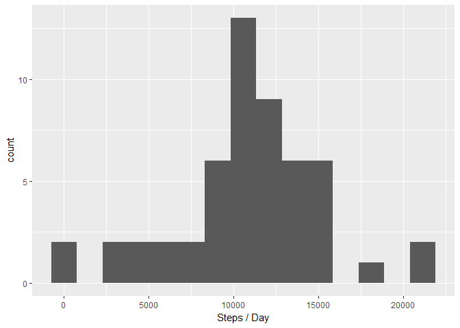
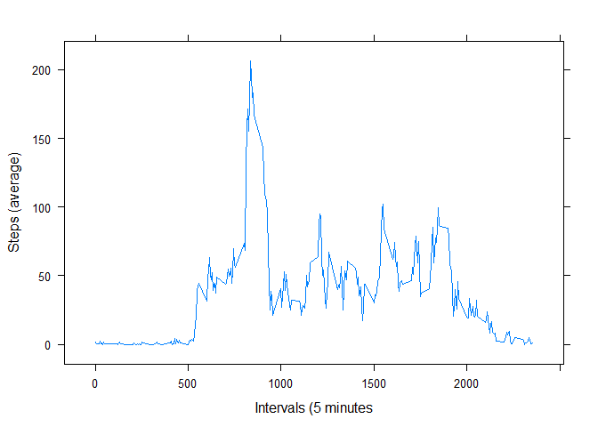
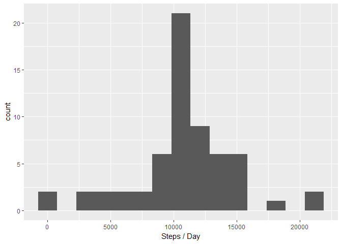
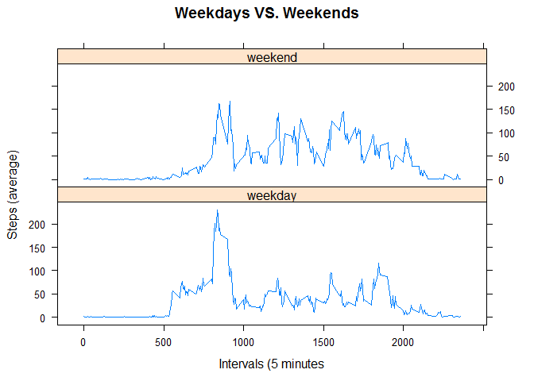

Reproducible Research: Peer Assessment 1
========================================

Project assumes the data, "activity.zip", is in the working directory

Loading and preprocessing the data
----------------------------------

Unzipping, reading and changing the data variable from 'factor' to
'date' + creating clean dataset

    unzip(zipfile="activity.zip")
    data <- read.csv("activity.csv")
    data$date <- as.Date(data$date)
    data_omit <- na.omit(data)

What is mean total number of steps taken per day?
-------------------------------------------------

Calculate the total number of steps taken per day and show as Histogram

    library(ggplot2)

    data_aggr_sum <- aggregate(data_omit$steps ~ data_omit$date, FUN = "sum")
    qplot(data_aggr_sum$`data_omit$steps`, bins = 15, xlab = "Steps / Day")

Calculate and report the mean and median of the total number of steps
taken per day

    mean(data_aggr_sum$`data_omit$steps`)

    ## [1] 10766.19

    median(data_aggr_sum$`data_omit$steps`)

    ## [1] 10765

What is the average daily activity pattern?
-------------------------------------------

Make a time series plot of the 5-minute interval (x-axis) and the
average number of steps taken, averaged across all days (y-axis)

    library(lattice)

    data_aggr_mean <- aggregate(data_omit$steps ~ data_omit$interval, FUN = "mean")
    xyplot(data_aggr_mean$`data_omit$steps`~ data_aggr_mean$`data_omit$interval`, type="l", ylab="Steps (average)", xlab="Intervals (5 minutes")

Which 5-minute interval, on average across all the days in the dataset,
contains the maximum number of steps?

    index <- which.max(data_aggr_mean$`data_omit$steps`)
    data_aggr_mean[index,]

    ##     data_omit$interval data_omit$steps
    ## 104                835        206.1698

Imputing missing values
-----------------------

There are a number of days/intervals where there are missing values. The
presence of missing days may introduce bias into some calculations or
summaries of the data.

Calculate and report the total number of missing values in the dataset.

    sum(is.na(data$steps))

    ## [1] 2304

Fill in all of the missing values in the dataset using the mean for that
interval The mean data is avalible from the previous question on average
daily activity pattern. Create a new dataset that is equal to the
original dataset but with the missing data filled in (imputing dataset)

    imputing <- data
    for(i in 1:17568){
      if (is.na(imputing$steps[i])) {
        changeNA <- data_aggr_mean$`data_omit$steps`[data_aggr_mean$`data_omit$interval` == imputing$interval[i]];
        imputing$steps[i] <- changeNA;
      }
    }

Make a histogram of the total number of steps taken each day

    data_aggr_sum_noNA <- aggregate(imputing$steps ~ imputing$date, FUN = "sum")
    qplot(data_aggr_sum_noNA$`imputing$steps`, bins = 15, xlab = "Steps / Day")

Calculate and report the mean and median total number of steps taken per
day.

    mean(data_aggr_sum_noNA$`imputing$steps`)

    ## [1] 10766.19

    median(data_aggr_sum_noNA$`imputing$steps`)

    ## [1] 10766.19

The shape of the graph does not differ from the estimates from the first
part of the asignment. Using the mean steps for a specific interval to
impute the NA values causes little impact to the mean and median but do
cause an increase in the number of steps taken per day for a specific
interval, as more data has been added to the analysis.

Are there differences in activity patterns between weekdays and weekends?
-------------------------------------------------------------------------

Create a new factor variable in the dataset with two levels –
“weekday” and “weekend” indicating whether a given date is a
weekday or weekend day.

    dayweek <- imputing
    dayweek$day <- weekdays(dayweek$date)
    for(x in 1:17568){
      if(dayweek$day[x] == "Saturday" | dayweek$day[x] == "Sunday"){
        dayweek$levels[x] <- "weekend"
      }
      else {
        dayweek$levels[x] <- "weekday"
      }
    }

Make a panel plot containing a time series plot of the 5-minute interval
(x-axis) and the average number of steps taken, averaged across all
weekday days or weekend days (y-axis).

    data_aggr_mean_day <- aggregate(dayweek$steps ~ dayweek$interval + dayweek$levels, FUN = "mean")
    xyplot(data_aggr_mean_day$`dayweek$steps` ~ data_aggr_mean_day$`dayweek$interval` | data_aggr_mean_day$`dayweek$levels`, layout = c(1,2), type="l", ylab="Steps (average)", xlab="Intervals (5 minutes", main = "Weekdays VS. Weekends")

